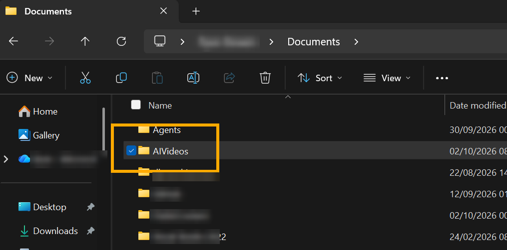
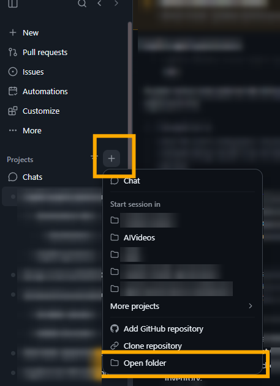
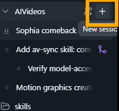
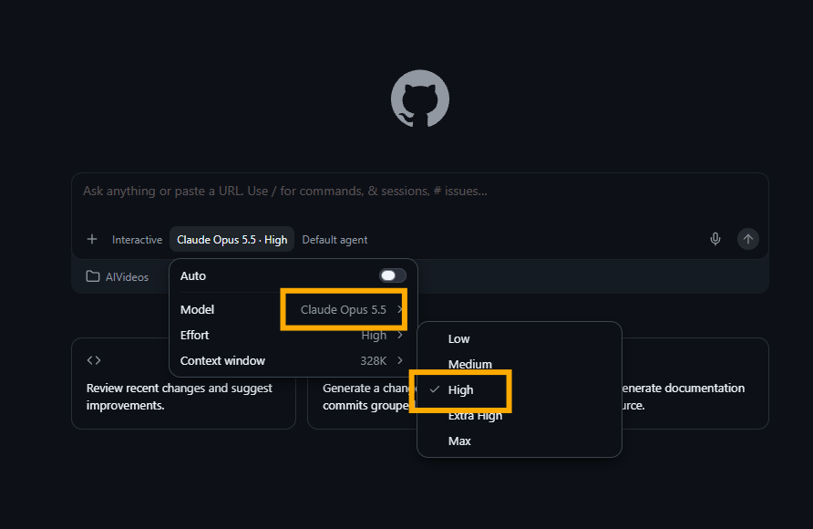

# AI video creation guide

How I made animated videos with the **GitHub Copilot app** and **Claude Opus 5.5**, with the prompts, source and reusable skills so you can try it yourself.

**Website:** https://ryanbowie.github.io/ai-video-creation-guide/

Every frame is drawn in code (HTML Canvas, SVG and WebGL) and rendered to MP4 with headless Edge and ffmpeg. There's no paid image or video generation and no npm. The music and sound effects are synthesised in code, and voiceovers use Microsoft Edge neural TTS.

> **Community project, not a Microsoft product.** This is a personal side project shared as is, under the MIT licence. It isn't supported, endorsed or maintained by Microsoft or GitHub.

## The videos

| Video | Look | Length | Prompt | Source |
|---|---|---|---|---|
| [Copilot Quest, Episode 1: Enter Copilot](docs/media/sofia-retro.mp4) | 90s cel-anime / arcade, CRT finish, chiptune | 89.5 s | [PROMPT.md](examples/sofia-retro/PROMPT.md) | [examples/sofia-retro](examples/sofia-retro) |
| [The Great Copilot Quest, Chapter One](docs/media/sofia-explorer.mp4) | Vintage explorer / adventure serial, 16 mm film, parchment map | 26 s | [PROMPT.md](examples/sofia-explorer/PROMPT.md) | [examples/sofia-explorer](examples/sofia-explorer) |
| [Copilot Pop: *I'm Upping My P(doom)* remake](docs/media/copilot-pop.mp4) (silent) | Papery watercolour, boiling ink, K-pop music video | 2:34 | [pdoom-prompt.md](prompts/pdoom-prompt.md) | [Prompt, stills and credits](examples/pdoom/README.md) |

## Guide to video creation

1. **Install the GitHub Copilot app.**
2. **Create a local folder** for your videos. Keep it outside OneDrive or any other synced folder: Copilot writes a lot of files (frames, renders, audio) and syncing slows everything down.
   
3. **Connect to the folder in the GitHub Copilot app.** Use **Projects → + → Open folder** and pick your folder.
   
4. **Start a new session in the folder** with **+ New session**.
   
5. **Select Claude Opus 5.5 and set reasoning effort to High.** Reasoning effort changes how much work it puts in. Higher effort means more complex results but takes more time.
   
6. **Modify one of the prompts** and send it. Start from the [starter template](prompts/template-prompt.md) or one of the example prompts, and fill in your context, reference videos and extra sources. You can ask Copilot to tailor the prompt to your needs first.

Then review the MP4, give feedback and iterate. Short first cuts (20–30 s) and concrete notes work best.

## Starter prompt

See [prompts/template-prompt.md](prompts/template-prompt.md) for the full template, how to add references and optional add-ons. You fill in three inputs:

- **[Context]**: what the video is about, who it's for and the story. It asks for an MP4 under about 30 s to review first.
- **[Reference Videos]**: screenshots, MP4s or links to videos and repos you like, and what you like about each. Copilot studies them for style, pacing and sound, then builds something original.
- **[Extra Sources]** (optional): documents, brand assets, a script, music you have the rights to, or facts to get right.

The rest of the prompt gives Copilot creative freedom over characters, animation, music, sound and voiceover, and points it at two community repos to learn from: [JohnHeibel/PDoomVideo](https://github.com/JohnHeibel/PDoomVideo) (advanced code-drawn animation synced to music) and [lemomo-ai/lemo-opuscar](https://github.com/lemomo-ai/lemo-opuscar) (43 film styles, each a style prompt plus a short film made entirely in code).

## Install the skills

The `skills/` folder holds the [Copilot skills](https://docs.github.com/copilot) that were built up while making these videos: the engines, cast, style rules and hard-won gotchas. Copy them into your Copilot skills folder so every new session can use them:

```powershell
git clone https://github.com/RyanBowie/ai-video-creation-guide.git
cd ai-video-creation-guide
New-Item -ItemType Directory -Force "$env:USERPROFILE\.copilot\skills" | Out-Null
Copy-Item .\skills\* "$env:USERPROFILE\.copilot\skills\" -Recurse -Force
```

| Skill | Use it for |
|---|---|
| `motion-graphics` | Story, pacing, transitions and SVG explainer videos. The entry point that routes to the others. |
| `character-rig` | A papery watercolour Canvas cast (Copilot idol, Office dancers, Clippy and more) and a beat-synced music-video engine. |
| `retro-anime` | 90s cel-anime / arcade / visual-novel look with a CRT pass (the Sofia Retro engine). |
| `explorer-quest` | Vintage explorer / adventure-serial look with a 16 mm film pass and a parchment world map (the Sofia Explorer engine). |
| `tts-voiceover` | Voiceover with Edge neural voices and word timings. |
| `audio-edit` | Cutting and fading songs and voiceover without clicks, and keeping the animation in sync. |
| `av-sync` | Checking that visuals line up with the voiceover, SFX and beats. |

## Run the examples yourself

You need Windows with Microsoft Edge and Python 3.

```powershell
pip install --user playwright imageio-ffmpeg edge-tts
cd examples\sofia-retro
python -m http.server 8000          # then open http://localhost:8000/sofia-retro.html and press Space
python export_mp4.py                # renders sofia-retro.mp4 (1920x1080, 30 fps)
```

The same works in `examples\sofia-explorer` with `sofia-explorer.html`. `make_voice.py` regenerates the voiceover (`voice.js`) and `stills.py` takes stills at given times.

## Credits

- **JohnHeibel/PDoomVideo** by John Heibel: the original *I'm Upping My P(doom)* video and code that inspired all of this. https://github.com/JohnHeibel/PDoomVideo
- **donald (@donaldjewkes)**: the one-prompt Opus 5.5 video prompt the P(doom) remake was adapted from. https://x.com/donaldjewkes/status/2102801274173587569
- **Song:** *I'm Upping My P(doom)*. Lyrics by [osmarks](https://docs.osmarks.net/hypha/p%28doom%29_song_objectively_correct_interpretation), built on an opening verse and chorus by MusicPerson, with lines from the EleutherAI Discord and help from Claude. Originally generated with Udio (November 2024, [YouTube](https://www.youtube.com/watch?v=uEB5E67vcPA)); the "Claude-Pop" version is by [deckard (@slimer48484)](https://x.com/slimer48484/status/2097752569212756134). The song and lyrics belong to their authors and aren't covered by this repo's licence. The remake is shared silent.
- **lemomo-ai/lemo-opuscar** by LemoLab (MIT): film-style references. Parts of the Sofia engines are adapted from it; see each example's `THIRD_PARTY_NOTICES.md`.
- **Natural Earth** (public domain): the world map coastlines in Sofia Explorer.
- Voiceovers: Microsoft Edge neural TTS via [edge-tts](https://github.com/rany2/edge-tts).

Sofia and her colleagues are fictional characters. Microsoft, Copilot, Office, Clippy and related names and logos are trademarks of Microsoft. They appear here as fan references in a non-commercial community project.

## Licence

[MIT](LICENSE) for the code, prompts and docs in this repo, except where a `THIRD_PARTY_NOTICES.md` says otherwise.
