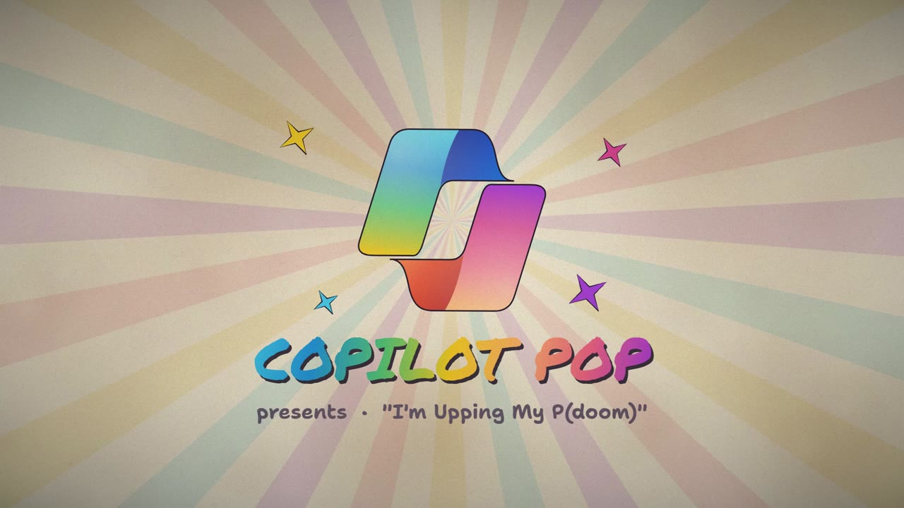
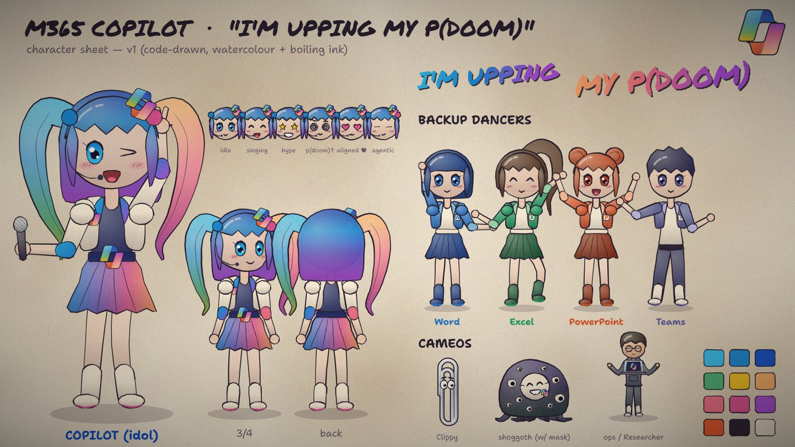

# Copilot Pop: "I'm Upping My P(doom)" remake

A Copilot-themed remake of the *I'm Upping My P(doom)* music video. A Copilot pop idol with rainbow twin-tails sings, with backing dancers from the Office family, Clippy, a cute masked shoggoth and plenty of Microsoft easter eggs. It's drawn entirely in code on an HTML Canvas in a papery watercolour, boiling-ink style.

| | |
|---|---|
|  |  |

**Watch the silent cut:** [copilot-pop.mp4](../../docs/media/copilot-pop.mp4) (2:34, 1280 × 720, no audio) or on the [website](https://ryanbowie.github.io/ai-video-creation-guide/#pdoom).

## What's here and what isn't

- **The prompt:** [prompts/pdoom-prompt.md](../../prompts/pdoom-prompt.md).
- **The engine:** the [character-rig](../../skills/character-rig/SKILL.md) skill holds the cast, props and beat-synced music-video scene engine built for this video. The [audio-edit](../../skills/audio-edit/SKILL.md) skill covers cutting bars from a song without audible seams.
- **The video, silent:** the full remake with the audio removed, because the song isn't ours to redistribute. The lyrics still appear on screen and belong to their authors (see Credits). Play the song alongside it, or watch the original with sound:
  - The song: https://www.youtube.com/watch?v=uEB5E67vcPA
  - Original video: https://youtu.be/8j-hR4fJywU
  - Original source code: https://github.com/JohnHeibel/PDoomVideo
- **Not included:** the audio track and the lyric timing data.

## Credits

- Original video and code by **John Heibel** ([JohnHeibel/PDoomVideo](https://github.com/JohnHeibel/PDoomVideo)).
- The one-prompt Opus 5.5 video prompt this was adapted from is by **donald (@donaldjewkes)**: https://x.com/donaldjewkes/status/2102801274173587569
- **Song:** *I'm Upping My P(doom)*. Lyrics by [osmarks](https://docs.osmarks.net/hypha/p%28doom%29_song_objectively_correct_interpretation), built on an opening verse and chorus by MusicPerson, with lines from the EleutherAI Discord and help from Claude. Originally generated with Udio (November 2024, [YouTube](https://www.youtube.com/watch?v=uEB5E67vcPA)); the "Claude-Pop" version is by [deckard (@slimer48484)](https://x.com/slimer48484/status/2097752569212756134). The song and lyrics belong to their authors and aren't covered by this repo's licence. The remake is shared silent.
